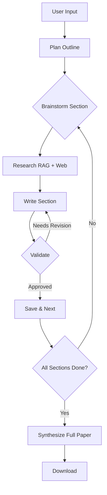

# Seminar Report Generator 📝🤖

An LLM-powered Seminar Report Generator built using **LangGraph**, **RAG**, and **Streamlit**.  
The system automatically generates structured academic seminar reports from user input and reference documents.

---

## ✨ Features

- **Multi-Agent Workflow**: Planning, research, writing, and validation agents
- **Hybrid RAG**: Combine local PDFs with web search
- **Smart State Management**: LangGraph-powered workflow orchestration
- **User-Friendly Interface**: Streamlit web app with PDF upload
- **Export Options**: Download as Markdown or PDF
- **Async Processing**: Fast parallel operations


---

## 🏗️ Project Architecture

📦 seminar-report-generator
┣ 📂 config # Configuration
┣ 📂 notebooks # Experiments
┣ 📂 src # Source code
┃ ┣ 📜 graph_builder.py
┃ ┣ 📜 nodes.py
┃ ┣ 📜 models.py
┃ ┣ 📜 prompts.py
┃ ┗ 📜 rag_setup.py
┣ 📂 streamlit_app # Web interface
┣ 📜 requirements.txt
┣ 📜 pyproject.toml
┗ 📜 README.md


---

## ⚙️ Tech Stack

- **Python 3.11**
- **LangGraph**
- **LangChain**
- **Vector Database (RAG)**
- **Streamlit**

---

## 🔑 Environment Setup

Create a `.env` file based on the example:

```bash
cp .env.example .env
```

Add your keys:

TAVILY_API_KEY=your_api_key_here

## 📦 Ollama Setup (Local LLMs)

This project uses Ollama to run local Large Language Models (LLMs) for planning, writing, and validation steps.

###🔹 Models used in this project

- qwen3:8b — primary writer model

- deepseek-r1 — critic / planner model

- 1️⃣ Install Ollama
- 2️⃣ Start Ollama Server
- 3️⃣ Pull Required Models
- 4️⃣ Configure Model Names - The models are configured in .env file

## 📦 Installation

```bash
pip install -r requirements.txt
```

## ▶️ Run the Application

```bash
streamlit run streamlit_app/app.py
```
## 🏗️ Architecture



### Workflow Logic

1. **Plan** – Generate a 5-section outline from the topic
2. **Brainstorm** – Extract key points per section
3. **Research** – Combine Tavily web search + RAG retrieval
4. **Write** – Draft section content using gathered context
5. **Validate** – Critic LLM reviews quality
6. **Revise Loop** – Rewrites until approved or max retries
7. **Save & Next** – Move to next section
8. **Synthesize** – Merge all sections into a final paper

## 🧠 How It Works

- User provides seminar topic and context

- Relevant documents are retrieved via RAG

- LangGraph executes section-wise report generation

- Final structured seminar report is synthesized

- Output is displayed via Streamlit UI, can download .md file

## 📌 Notes

- Designed with modularity and extensibility in mind

- Configuration handled via settings.py (environment-driven)

- Suitable for academic, research, and demo use cases
